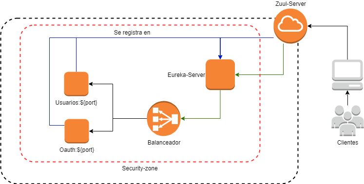

# Prueba Técnica
El siguiente proyecto cuenta con los pasos a seguir para ejecutar la prueba técnica de manera correcta.
<br><br>

# Arquitectura Planteada

<br><br>

# Requisitos Técnicos

1. Se debe tener instalado el aplicativo **GIT**, con este aplicativo se podrán descargar los proyectos a ejecutar.

2. Se debe tener instalado y configurado **Maven 3.6.3 o Superior**, con este aplicativo se podra compilar y ejecuatr los proyectos `Spring Boot`.
<br><br>

## Si no desea Instalar GIT
En caso que no se desee instalar **GIT** se pueden descargar los proyectos desde los siguientes links, de los cuales se debe descargar el **TAG** con la etiqueta **V2**.
Al realizar este paso se debe omitir el paso **Descargar proyectos**

1. `springboot-servicio-eureka-server`, [link Descarga](https://github.com/robinarehen/springboot-servicio-eureka-server/tags).

2. `springboot-servicio-usuarios`, [Link Descarga](https://github.com/robinarehen/springboot-servicio-usuarios/tags).

3. `springboot-servicio-oauth`, [Link Descarga](https://github.com/robinarehen/springboot-servicio-oauth/tags).

4. `springboot-servicio-zuul-server`, [Link Descarga](https://github.com/robinarehen/springboot-servicio-zuul-server/tags).

Al finalizar las descargas, se deben descomprimir los proyectos y seguir con el paso **Ejecutar Proyectos**

# Pasos para Ejecutar los proyectos
Se deben seguir los siguientes pasos para poder garantizar la correcta ejecución de los proyectos, los cuales permitirán realizar la prueba técnica sin problemas.<br>

La prueba cuenta con un total de 5 proyectos que trabajar de forma coordinada.

## Descargar proyectos
1. `springboot-servicio-eureka-server`, proyecto encargado de administrar la ubicación de los servicios.

2. `springboot-servicio-usuarios`, proyecto encargado de administrar los usuarios.

3. `springboot-servicio-oauth`, proyecto encargado de administrar la seguridad mediante Oauth-2.

4. `springboot-servicio-zuul-server`, proyecto encargado de exponer los servicios antes los clientes que pueden ser aplicativos web, móviles y otros servicios, etc.

5. `Frontend Angular`, Pendiente

```
git clone https://github.com/robinarehen/springboot-servicio-eureka-server.git

git clone https://github.com/robinarehen/springboot-servicio-usuarios.git

git clone https://github.com/robinarehen/springboot-servicio-oauth.git

git clone https://github.com/robinarehen/springboot-servicio-zuul-server.git
```


## Ejecutar Proyectos
Para este paso se debe tener **Maven** previamente configurado.<br>
Se debe abrir una terminal o consola de `cmd` si estamos en **Windows** para cada proyecto por separado.

1. El primer proyecto a Ejecutar debe ser `springboot-servicio-eureka-server`, debido a que los demás servicios lo intentaran ubicar al momento de iniciar.
```
cd springboot-servicio-eureka-server/

mvn clean install

mvn spring.boot::run
```

2. Se inicia el servicio `springboot-servicio-usuarios` en una nueva terminar, debe estar ejecutandose el proyecto `springboot-servicio-eureka-server`.
```
cd springboot-servicio-usuarios/

mvn clean install

mvn spring.boot::run
```

3. Se inicia el servicio `springboot-servicio-oauth` en una nueva terminar, debe estar ejecutandose el proyecto `springboot-servicio-eureka-server`.
```
cd springboot-servicio-oauth/

mvn clean install

mvn spring.boot::run
```

4. Se inicia el servicio `springboot-servicio-zuul-server` en una nueva terminar, debe estar ejecutandose el proyecto `springboot-servicio-eureka-server`.
```
cd springboot-servicio-zuul-server/

mvn clean install

mvn spring.boot::run
```

# Pruebas con Postman
Los servicios se pueden probar mediante el aplicativo **Postman**, para lo cual se deja una colección de nombre ` Spring-Cloud.postman_collection.json` la cual se debe importar.


## Obtener Token
El primer paso es generar un **Token** para poder realizar las operaciones de consulta, creación, modificación y eliminación de usuarios.
Se debe abrir el endpoint de nombre `Get Token`, se dejan los mismo datos que se muestran en la imagen.


## Consultar Usuarios
Para este paso se debe copiar el valor del atributo del `access_toke` de la respuesta del paso anterior, se debe pegar como se muestra en la siguiente imagen y se lanza la petición con el botón **SEND** al final de la url.


# H2 Database
Se utiliza `H2` como base de datos embebida, a la cual se puede acceder desde el siguiente link [Test database](http://localhost:8081/h2-console/). <br>
los parametros para acceder son:
```
 Driver class : org.h2.Driver
 JDBC URL: jdbc:h2:mem:testdb
 User name : sa
 password :
```
Al iniciar el proyecto se crean datos de ejemplo, los cuales puenden ser consultados con las siguientes querys.

```sql
SELECT * FROM USUARIOS ;
SELECT * FROM ROLES ;
SELECT * FROM USUARIOS_ROLES ;
```
