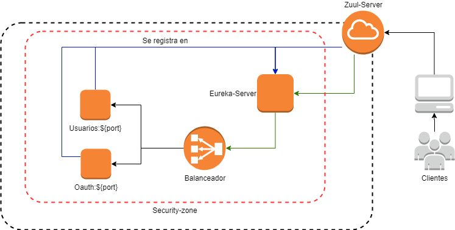
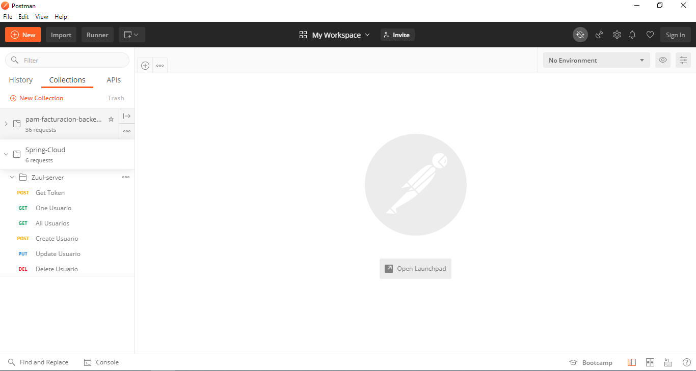
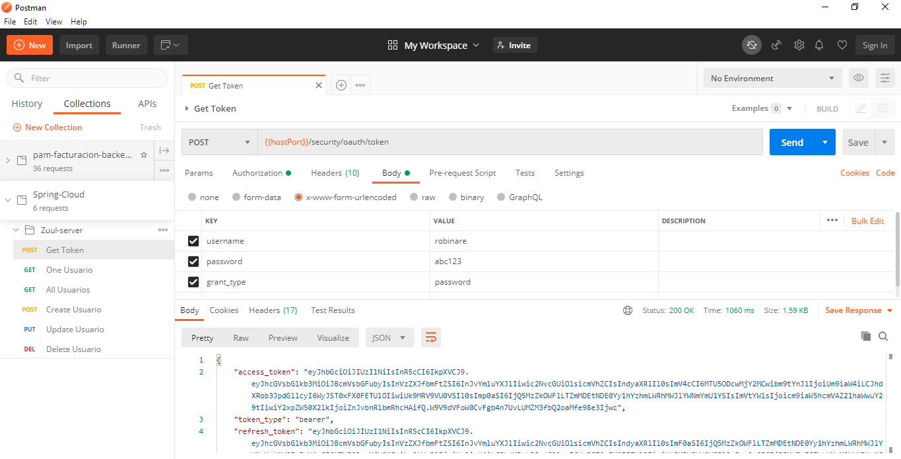
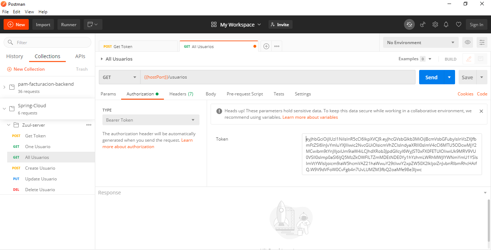

# Prueba Técnica
El siguiente proyecto cuenta con los pasos a seguir para ejecutar la prueba técnica de manera correcta.
<br><br>

# Arquitectura Planteada

<br><br>

# Requisitos Técnicos

1. Se debe tener instalado el aplicativo **GIT**, con este aplicativo se podrán descargar los proyectos a ejecutar.

2. Se debe tener instalado y configurado **Maven 3.6.3 o Superior**, con este aplicativo se podra compilar y ejecuatr los proyectos `Spring Boot`.
<br><br>

3. Se debe tener instalado **Nodejs 12.18.x LTS o Superior**, con este aplicativo se prodra configurar el proyecto de angular.

4. Una vez instalado **Nodejs** se debe realizar la instalación de angular con el siguiente comando.
```
npm install -g @angular/cli
```

# Pasos para Ejecutar los proyectos
Se deben seguir los siguientes pasos para poder garantizar la correcta ejecución de los proyectos, los cuales permitirán realizar la prueba técnica sin problemas.<br>

La prueba cuenta con un total de 5 proyectos que trabajar de forma coordinada.

## Ejecutar Proyectos
Para este paso se debe tener **Maven** previamente configurado.<br>
Se debe abrir una terminal o consola de `cmd` si estamos en **Windows** para cada proyecto por separado.

1. El primer proyecto a Ejecutar debe ser `springboot-servicio-eureka-server`, debido a que los demás servicios lo intentaran ubicar al momento de iniciar.
```
cd springboot-servicio-eureka-server/

mvn clean install

mvn spring.boot::run
```

2. Se inicia el servicio `springboot-servicio-usuarios` en una nueva terminal.
```
cd springboot-servicio-usuarios/

mvn clean install

mvn spring.boot::run
```

3. Se inicia el servicio `springboot-servicio-oauth` en una nueva terminal.
```
cd springboot-servicio-oauth/

mvn clean install

mvn spring.boot::run
```

4. Se inicia el servicio `springboot-servicio-zuul-server` en una nueva terminal.
```
cd springboot-servicio-zuul-server/

mvn clean install

mvn spring.boot::run
```

5. Se inicia el frontend `springboot-servicio-frontend` en una nueva terminal.
```
cd springboot-servicio-frontend/

npm install

ng serve -o
```

# Pruebas con Postman
Los servicios se pueden probar mediante el aplicativo **Postman**, para lo cual se deja una colección de nombre ` Spring-Cloud.postman_collection.json` la cual se debe importar.



## Obtener Token
El primer paso es generar un **Token** para poder realizar las operaciones de consulta, creación, modificación y eliminación de usuarios.
Se debe abrir el endpoint de nombre `Get Token`, se dejan los mismo datos que se muestran en la imagen.



## Consultar Usuarios
Para este paso se debe copiar el valor del atributo del `access_toke` de la respuesta del paso anterior, se debe pegar como se muestra en la siguiente imagen y se lanza la petición con el botón **SEND** al final de la url.



# H2 Database
Se utiliza `H2` como base de datos embebida, a la cual se puede acceder desde el siguiente link [Test database](http://localhost:8081/h2-console/). <br>
los parametros para acceder son:
```
 Driver class : org.h2.Driver
 JDBC URL: jdbc:h2:mem:testdb
 User name : sa
 password :
```
Al iniciar el proyecto se crean datos de ejemplo, los cuales puenden ser consultados con las siguientes querys.

```sql
SELECT * FROM USUARIOS ;
SELECT * FROM ROLES ;
SELECT * FROM USUARIOS_ROLES ;
```
